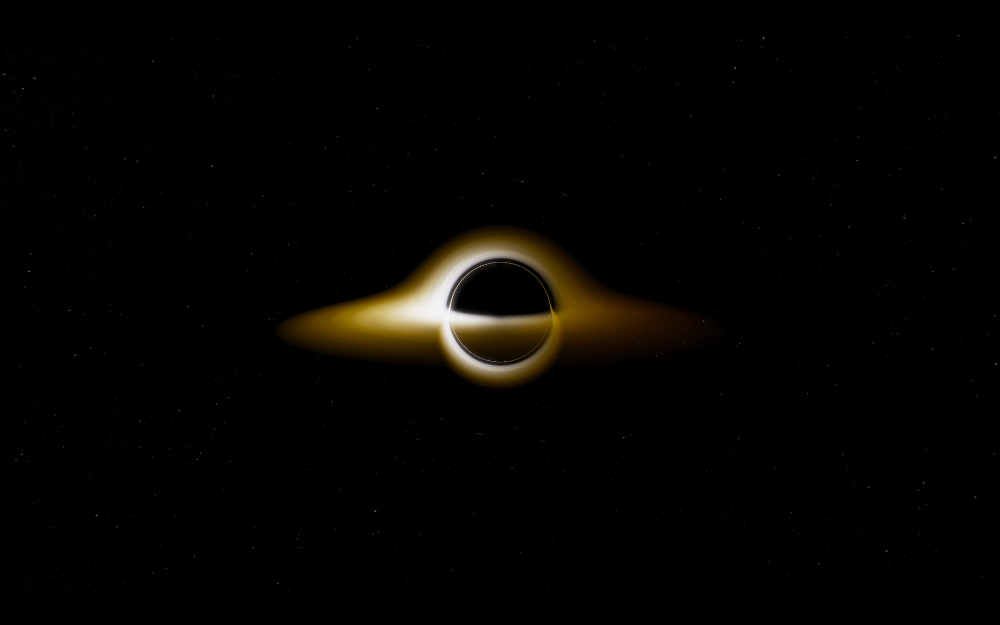

# BlackHole Ray Tracer



## Description
Simulation of Schwarzschild black hole using OpenGL ray marching.

## How Realistic?
- [x] Gravitational light deflection
- [x] Gravitational redshift of accretion disk
- [x] Doppler effect and relativistic beaming of accretion disk
- [x] Realistic temperature distribution
- [x] Accretion disk(Innermost stable circular orbit, orbiting speed)


Possible future updates:
- [ ] Doppler shift, redshift of background stars
- [ ] Observer position, velocity
- [ ] Orbiting star

## Build
### Prerequisites
- C++17 compiler
- cmake 3.25+
- OpenGL 4.3+ (for compute shader)

### Linux
1. Install dependencies
```
sudo apt install libglfw3-dev libglfw3
sudo apt install libglm-dev
```
2. Clone repository
```
git clone https://github.com/hydrogendeuteride/BlackHoleRayTracer.git
```
3. Build
```
cmake -S . -B build -DCMAKE_BUILD_TYPE=Release
cmake --build build
```
### Windows
1. Install dependencies using vcpkg
```
vcpkg install glfw3 glm glew
vcpkg integrate install
```
2. Clone repository
```
git clone https://github.com/hydrogendeuteride/BlackHoleRayTracer.git
```
3. Build
```
mkdir build
cd build

cmake ..
cmake -G "Visual Studio 17 2022" ..
cmake --build . --config Release
```

## Controls
- Mouse right click&drag to rotate camera
- H to disable HUD
- C to change camera mode(orbit <-> free, default orbit)
- WASD to move(free camera mode only)
- Shift/Control to move up/down(free camera mode only)
- Q/E to roll camera(free camera mode only)

## Performance
### Test Conditions: 
- Screen mode: full screen
- OS: Windows 11 
- Rendering resolution: 1920x1080

| Processor       | GPU                     | FPS      |
|-----------------|-------------------------|----------|
| AMD Ryzen 6800HS| NVIDIA RTX 3050 Mobile  | 40~42FPS |
| AMD Ryzen 6800HS| Radeon 680M             | 26~29FPS |


## References
- OpenGL, GLFW, GLM, GLAD
- stb_image
- Dear ImGui
- realistic space skybox from [NASA Deep Star Maps 2020](https://svs.gsfc.nasa.gov/4851)
- Hack font from [source-foundry](https://github.com/source-foundry/Hack)
- Schutz, _A First course in General Relativity_. 
- Blackhole simulation by [rossning](https://github.com/rossning92/Blackhole)
- Realistic Accretion disk modeling from https://jila.colorado.edu/~pja/astr3830/lecture26.pdf
- Bruneton, Eric. _Real-time High-Quality Rendering of Non-Rotating Black Holes._ arXiv:2010.08735v1 (2020). Available at: https://arxiv.org/abs/2010.08735v1

## License
[MIT License](LICENSE)